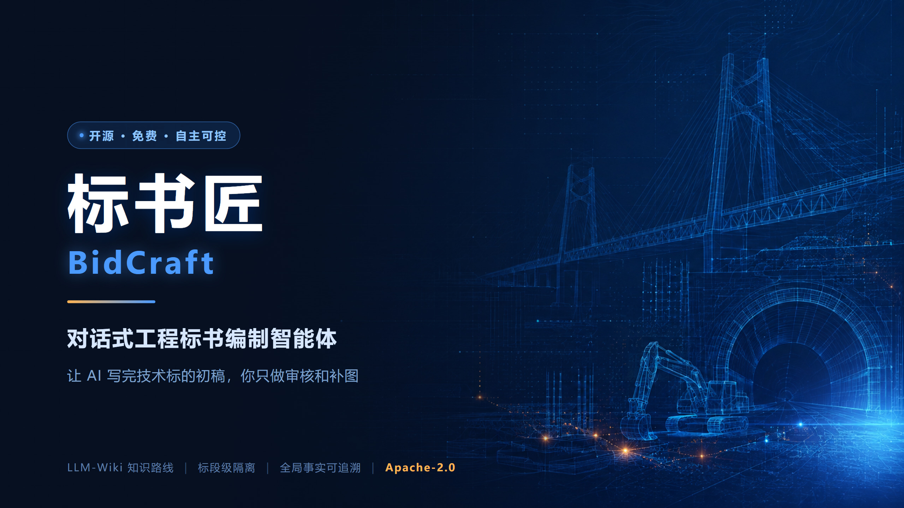
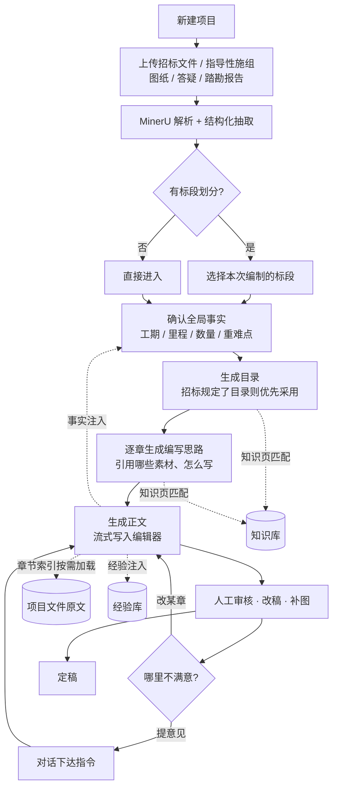
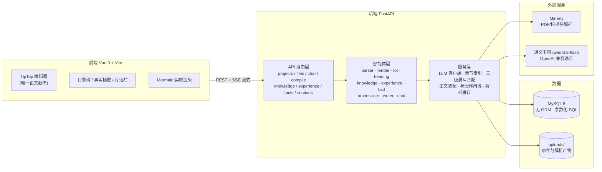

<div align="center">



# 标书匠 · BidCraft

**开源 · 对话式 · 工程标书编制智能体**

让 AI 写完技术标的初稿，你只做审核和补图。

[](LICENSE)
[](backend/requirements.txt)
[](frontend/package.json)
[](CONTRIBUTING.md)
[](#为什么开源)

[中文](README.md) · [English](README_EN.md)

</div>

---

## 它解决什么问题

做技术标的人都知道这份苦：

- 一本施工组织设计动辄 **几百页、几十万字**，其中真正"因项目而异"的可能不到 20%；
- 剩下 80% 是**抄改 + 拼装**：翻历史标书、翻工法库、把项目名和数字换一遍、调整章节顺序；
- 换个项目重来一遍，换个标段重来一遍，**经验留不下来**；
- 时间全耗在"复制粘贴 + 找素材"上，真正需要人来判断的地方——重难点分析、针对性措施——反而没时间深想。

**标书匠要做的事很具体：把"抄改拼装"这 80% 交给 AI 做掉，把人的时间还给那 20%。**

它不是"一键生成一篇通顺废话"的玩具。它围绕**工程文档的真实结构**设计：
招标文件怎么规定目录、标段怎么划分、哪些数字必须精确、哪些内容必须来自历史工法库、
哪些话不能写（废标风险）——这些都被建模进了编制流程里。

> **编制周期从"数周"压到"数天"，人是审核者与决策者，不是打字员。**

<table>
<tr>
<td width="50%"><br/><div align="center"><sub>三栏工作台：项目文件 · 目录树 · 正文编辑器 · 对话编制</sub></div></td>
<td width="50%"><br/><div align="center"><sub>AI 生成正文，直接落进所见即所得编辑器</sub></div></td>
</tr>
<tr>
<td width="50%"><br/><div align="center"><sub>说人话就行，工具执行过程可展开核对</sub></div></td>
<td width="50%"><br/><div align="center"><sub>流程／组织类关系图用 Mermaid 表达，编辑器内实时渲染</sub></div></td>
</tr>
<tr>
<td width="50%"><br/><div align="center"><sub>历史施组 → 结构化知识页（怎么写 / 要点 / 典型表图）</sub></div></td>
<td width="50%"><br/><div align="center"><sub>全局事实表：每条数字都有出处，可编辑、可追溯</sub></div></td>
</tr>
</table>

<sub>📷 以上截图均为**虚构演示项目**（云岭至江口高速公路 YJ-3 合同段），不含任何真实工程资料。</sub>

---

## 核心能力

| 能力 | 说明 |
|---|---|
| 📄 **招标文件解析** | PDF / 扫描件 / 图片型文件走 MinerU（OCR + 版面还原），Word / Excel 有各自更精确的解析通道。一份招标文件读进来，标段划分、评分办法、技术要求、编制要求、规定的目录结构全部结构化落库 |
| 🗂 **标段隔离** | 多标段项目选中一个标段后，事实、文件片段、知识素材全部按标段过滤——**正文里不会混进别的标段的工点** |
| 📚 **知识库（历史施组 → 知识页）** | 把你过去中标的施组喂进去，自动切成章节树，逐章提炼成"编制方式 + 要点 + 典型表格 + 图片 + 适用范围"的知识页。**越用越厚，越用越像你自己的风格** |
| 🔧 **工艺工法库** | 工法文档一篇一条概况索引，需要时整篇注入正文上下文 |
| 🌳 **目录生成** | 招标文件规定了目录就优先采用；没规定则按工程类型生成，逐级展开、流式"长出来" |
| 💡 **逐章编写思路** | 正文之前先生成"这一节打算怎么写、引用哪些素材"，可人工审阅调整——**先对齐思路，再动手写，避免几十万字写完才发现方向偏了** |
| ✍️ **正文流式生成** | 单章生成 / 批量生成 / 对话指定重写。正文直接流式写入所见即所得编辑器，生成完即可改 |
| 💬 **对话式编制** | 不说"点击按钮"，直接说人话："第三章重写一下，突出隧道超前地质预报"、"把工期那几个数字统一成 26 个月"。模型自主决定调哪些工具 |
| 🧾 **全局事实表** | 工期、里程、数量……这些数字单独抽出来管理，标明出处，正文引用可追溯，杜绝"同一个数在文档里出现三种写法" |
| 🎓 **经验学习** | 你每次改 AI 的稿子、否决一次生成、在对话里提一次意见，都会被提炼成"写法偏好"沉淀下来，下次生成自动遵守 |
| 📊 **Mermaid 关系图** | 流程 / 组织 / 职责类关系图用 Mermaid 表达，编辑器内实时渲染、双击改源码 |

---

## 操作流程



**一句话概括**：*上传 → 解析 → 选标段 → 确认事实 → 生成目录 → 过一遍思路 → 生成正文 → 改稿定稿*。

每个环节都可以停下人工干预，不需要"一键黑箱跑到底"。

---

## 快速开始

### 方式一：把项目丢给 AI 助手（最省事）⭐

本项目自带 [`AGENTS.md`](AGENTS.md)，Claude Code / Codex / Cursor / Trae / Windsurf / Cline 等 AI 编程助手会自动读取它。

```bash
git clone https://github.com/zeronezer/bidcraft.git
cd bidcraft
```

然后把目录丢给你的 AI 助手，说一句：

> **"按 AGENTS.md 把这个项目跑起来"**

它会自动检查运行时、装依赖、引导你填配置、建表、启动、并验证页面能打开。首次配置大约 10 分钟。

### 方式二：自己动手（4 步）

**第 1 步 · 准备**

```bash
git clone https://github.com/zeronezer/bidcraft.git
cd bidcraft
```

需要本机有 **Python ≥ 3.11**、**Node ≥ 18**、**MySQL 8**。

**第 2 步 · 装依赖**

```bash
pip install -r backend/requirements.txt
cd frontend && npm install && cd ..
```

**第 3 步 · 配置**

```bash
cp .env.example .env
```

打开 `.env`，填 3 处必填项：

| 配置项 | 去哪拿 | 是否必须 |
|---|---|---|
| `MYSQL_*` | 你本机/云上的 MySQL。先建库：`CREATE DATABASE bid_chat_db DEFAULT CHARSET utf8mb4;` | ✅ 必须 |
| `LLM_API_KEY` | [阿里云百炼](https://bailian.console.aliyun.com) → API-KEY 管理 | ✅ 必须 |
| `MINERU_API_TOKEN` | [mineru.net](https://mineru.net) → API 管理 → 创建 Token | ✅ 必须（不解析 PDF 可暂缺） |

> 💡 **想先看看界面？** 没有百炼 Key 和 MinerU Token 也能启动 —— 页面能打开、能新建项目，
> 只是上传解析和 AI 生成会失败。可以先跑通框架再补 Key。

**第 4 步 · 建表并启动**

```bash
python scripts/check_env.py --init-db   # 自检 + 建表（会逐项告诉你缺什么、去哪补）

# Windows
scripts\start_dev.bat

# macOS / Linux
bash scripts/start_dev.sh
```

浏览器打开 **http://127.0.0.1:5180** 即可。

<details>
<summary><b>方法三：完全手动启动（不用一键脚本）</b></summary>

```bash
# 终端 1 —— 后端
cd backend && python -m uvicorn app.main:app --reload --port 8000

# 终端 2 —— 前端
cd frontend && npm run dev
```
</details>

<details>
<summary><b>常见问题</b></summary>

| 现象 | 处理 |
|---|---|
| `Access denied for user` | `.env` 里 MySQL 账号密码不对 |
| `Unknown database 'bid_chat_db'` | 数据库还没建，见第 3 步 |
| 页面能开但接口 404 | 后端没起来，或不在 8000 端口 |
| 前端端口冲突 | 改 `frontend/vite.config.js` 里的 `server.port`（默认 5180） |
| 上传后一直"解析中" | MinerU Token 无效或额度不足，看后端终端日志 |
| MinerU 报 TLS/SSL 错误 | 本机代理污染了 CDN 的 DNS，在 `.env` 设 `MINERU_CDN_IPS=<真实IP>` |
| docx 解析失败 | docx 走 python-docx 原生解析，不需要本机装 Word/WPS；若报错请贴后端日志 |

更完整的排查见 [`AGENTS.md`](AGENTS.md#常见问题排查)。
</details>

---

## 标书编制智能体可调用的工具

对话栏里说的每句话，背后是模型在自主决定调用下面这些工具。**它们全部作用于真实数据，不是"假装执行"**——
模型声称"已生成第三章"，系统会核验本轮是否真有对应的工具成功记录，没有就否决并要求重做。

| 工具 | 作用 |
|---|---|
| `search_knowledge_pages` | 检索历史施组知识页（专业标签 + 标题相似度 + AI 终判三级漏斗） |
| `search_project_files` | 按章节索引查本项目文件**完整原文**（不切片、不截断） |
| `list_project_files` | 列出本项目已上传的文件清单 |
| `list_facts` | 查询全局事实表（按当前标段过滤） |
| `list_tender_requirements` | 查询结构化招标要求（评分办法逐项分值、技术/编制要求、废标风险） |
| `get_chapter_tree` | 读取目录树全貌 |
| `find_chapters` | 按标题/编号检索**真实**节点 ID（防止模型编造不存在的章节） |
| `read_section` | 读取某章已生成的正文 |
| `write_chapter` | 生成/重写单章正文（支持附加本次要求） |
| `write_batch` | 批量生成全部待写章节（后台执行，需明确指令才触发） |
| `rewrite_section` | 直接改写某章正文并落库（旧稿自动保留可回退） |
| `generate_outlines` | 为还没有思路的章节批量补生成编写思路 |
| `regenerate_outline` | 单章重新生成编写思路 |
| `edit_toc` | 目录增 / 删 / 改名（不触碰已写正文） |
| `search_experiences` | 查询已沉淀的编写经验与偏好条目 |

**扩展方式**（这就是可扩展性的证明）：在 [`chat_agent.py`](backend/app/agents/chat_agent.py) 的 `TOOLS` 列表加一条 schema，
在 `_exec_tool()` 加一个分发分支，实现对应的 `_tool_*` 函数——新工具立刻对对话链路可用，无需改前端。

> 也就是说：**这个系统的能力边界，等于你愿意给它加多少工具。**

---

## 技术架构



### 关键技术选择

| 选择 | 理由 |
|---|---|
| **LLM-wiki 而非 RAG** | 施组是强结构文档，按"章节意图"组织知识比模糊语义检索更准；且每条知识都有出处，可审计。详见 [思路/01](思路/01-为什么用-LLM-Wiki-而不是-RAG.md) |
| **章节索引按需加载** | 项目文件不切片、不做向量检索：解析时用 LLM 给每章生成"概要 + 适用范围"索引，用时 AI 看索引选章，再取**完整原文**。避免切片导致上下文割裂 |
| **全局事实表** | 数字类信息单独抽取、标明出处、人工可改。正文引用有据可查，不会出现同一数字三种写法 |
| **编辑器是唯一内容载体** | AI 生成结果直接流式写入 TipTap，不存在"AI 稿"与"正式稿"两份数据打架 |
| **LLM 只出结构化数据，图形由代码渲染** | 涉及计算和图形的地方（如关系图布局）交给确定性代码，模型只负责产出数据 |
| **标段是操作的基本单位** | 所有取数、取素材、生成正文都按选定标段过滤，从机制上杜绝串标段 |
| **prompt 按稳定前缀组织** | 逐章生成是全系统调用最频繁的环节，稳定前缀能命中缓存，显著降低输入成本 |

更多设计权衡见 **[`思路/`](思路/README.md)** —— 那里有 7 篇"当初为什么这么定"的完整复盘，
包括踩过的坑和不成立的想法。

---

## 后续规划

### ✅ 已实现

- 招标文件解析与结构化抽取（标段 / 评分办法 / 技术要求 / 编制要求 / 废标风险）
- 标段识别、标段档案抽取、按标段定向重提取
- 知识库（历史施组 → 知识页）与工艺工法库
- 目录生成（招标规定目录优先）+ 逐章编写思路
- 正文流式生成（单章 / 批量 / 对话指定重写）
- 对话式智能体（15 个工具、真流式、执行核验）
- 全局事实表 + 引用来源可追溯
- 经验学习（改稿 / 否决 / 对话纠偏三个触发点）
- Mermaid 关系图渲染与编辑

### 🔄 规划中

- **正文图文并茂** —— 图片的自动定位、编号与图注编排
- **Mermaid 自动配图** —— 按章节内容自动判断哪里需要流程图/组织图并生成
- **导出 Word / PDF** —— 带样式、图表、页码的成品交付格式
- **质检智能体** —— 评分项覆盖度检查、数字一致性核对、敏感表述扫描
- **进度图表** —— 横道图与单代号网络图（CPM 算法已有实现基础，正重新设计交互）
- **Docker Compose 一键部署**
- **多模态投标文件理解** —— 直接读懂图纸与扫描表格
- **团队协作** —— 多人分章编制、进度汇总

> 欢迎认领。有想做的功能，直接开 Issue 聊。

---

## 贡献指南

欢迎任何形式的贡献：提 Issue、修 bug、加功能、改文档、翻译、分享使用经验。

```bash
# 1. Fork 后克隆
git clone https://github.com/<你的用户名>/bidcraft.git
cd bidcraft

# 2. 建分支
git checkout -b feat/your-feature

# 3. 开发（配置见「快速开始」）
#    后端改动会自动重载；前端有 HMR

# 4. 提交（建议遵循 Conventional Commits）
git commit -m "feat: 增加 XX 能力"
git commit -m "fix: 修复 XX 章节匹配失败"

# 5. 推送并发起 PR
git push origin feat/your-feature
```

**上手前建议先读**：

| 你要做的事 | 先读 |
|---|---|
| 任何改动 | [`AGENTS.md`](AGENTS.md)（项目结构、约定、坑） |
| 改 AI 生成效果 | `backend/app/agents/*.py` 里的 prompt 常量（prompt 内嵌，无独立模板目录） |
| 加对话工具 | [`chat_agent.py`](backend/app/agents/chat_agent.py) 的 `TOOLS` + `_exec_tool` |
| 改数据结构 | `scripts/init_db.sql`（**建表/字段必须写中文 COMMENT**） |
| 理解设计取舍 | [`思路/`](思路/README.md) |

**开发约定**：

- 后端：PEP 8，类型标注尽量补；数据库访问走 `app/core/database.py`，**参数化 `%s`，不拼 SQL**
- 前端：Vue 3 组合式 API + `<script setup>`
- 提交信息：`feat:` / `fix:` / `docs:` / `refactor:` / `chore:`
- **不要提交** `.env`、`uploads/`、任何真实工程资料（`.gitignore` 已默认拦截 `*.pdf` / `*.docx` / `*.xlsx`）

---

## 为什么开源

这个项目最初是做给自己用的——受够了熬夜改标书。

后来想明白一件事：**标书编制这件事的痛点太普遍了**。每个工程局、每个咨询公司、每个做技术标的团队都在经历同样的重复劳动。
如果这套东西只留在自己手里，它最多省一个人的时间；放出来，可能会省很多人的时间。

而且这类工具**天然应该私有部署**：

- 招标文件、图纸、历史标书**全都是涉密资料**，不该上传到任何第三方 SaaS；
- 各家有各家的历史积累和行文习惯，通用产品喂不出你的味道；
- 编制逻辑因企业而异，**能改代码才叫真的可控**。

所以：

- ✅ **完全免费**，无任何付费墙、无功能阉割版、无"企业版请联系销售"
- ✅ **Apache-2.0 协议**，可商用、可修改、可闭源分发，**唯一要求是注明来源**
- ✅ **数据 100% 在你自己服务器上**，除了你主动调用的 LLM 与解析服务，没有任何数据外流
- ✅ **不锁定**：LLM 走 OpenAI 兼容接口，换个 `LLM_BASE_URL` 就能换成任何厂商的模型
- ✅ **用爱发电**，不接受捐赠，只希望你用得顺、有问题提 Issue、有余力提 PR

如果这个项目帮你少加了几个班，**给个 Star 就是最好的回报**。

---

## 联系作者

有问题、有想法、想交流工程 AI 的落地经验，都欢迎：

- 🐛 **Bug / 功能建议** → [提交 Issue](https://github.com/zeronezer/bidcraft/issues)（问题能沉淀下来，后来的人也能搜到）
- 💬 **微信** → 扫码加我（注明来意）

<div align="center">

</div>

- 📧 **邮箱** → sunalight@foxmail.com

> 工程行业的朋友如果只是想聊聊"这玩意在我这儿能不能用"，也欢迎直接加微信。

---

## 开源协议与致谢

本项目采用 [Apache License 2.0](LICENSE)。

**你可以自由地**商用、修改、闭源分发、私有部署；**唯一的要求是注明来源**。
具体要求与可直接复制的标注模板见 [`ATTRIBUTION.md`](ATTRIBUTION.md)。

### 第三方依赖

本项目的运行依赖这些优秀的服务与开源项目，在此致谢（完整清单见 [`NOTICE`](NOTICE)）：

- **[MinerU](https://mineru.net)**（上海人工智能实验室 OpenDataLab）—— 文档解析能力来自它
- **[阿里云百炼](https://bailian.console.aliyun.com)** —— 提供通义千问系列模型推理
- **[FastAPI](https://fastapi.tiangolo.com)** · **[LangGraph](https://github.com/langchain-ai/langgraph)** · **[PyMySQL](https://github.com/PyMySQL/PyMySQL)**
- **[Vue 3](https://vuejs.org)** · **[Element Plus](https://element-plus.org)** · **[Tiptap](https://tiptap.dev)** · **[Mermaid](https://mermaid.js.org)** · **[Vite](https://vite.dev)**

### 关于数据

- 本仓库**不包含任何真实工程资料**，README 中的截图与示例均为**虚构演示项目**。
- 你自己上传的招标文件、图纸、历史标书等资料，版权与保密责任由你自行承担。

---

<div align="center">

**如果这个项目对你有用，请给一个 ⭐ Star —— 这是对"用爱发电"最实在的鼓励。**

[⬆ 回到顶部](#标书匠--bidcraft)

</div>
