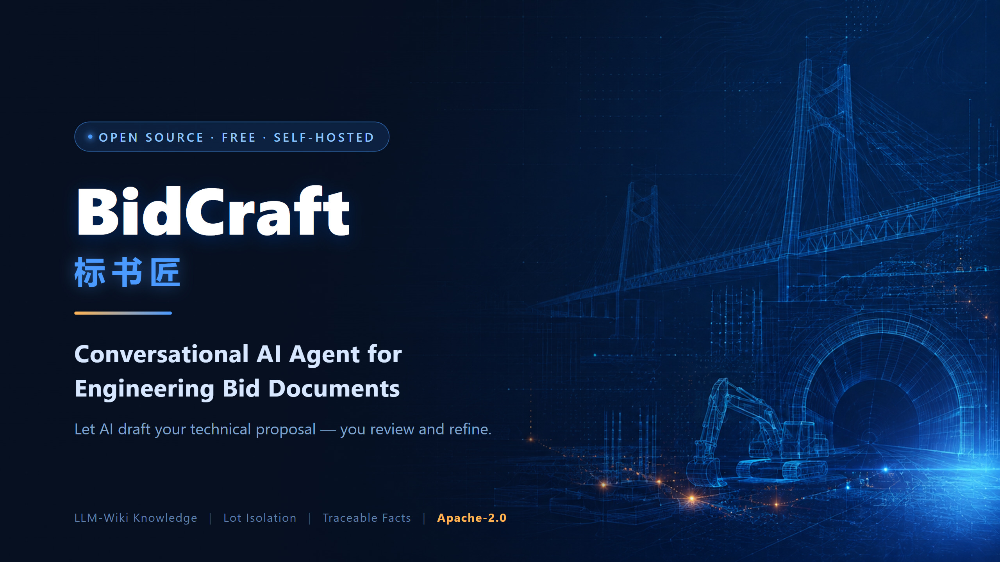
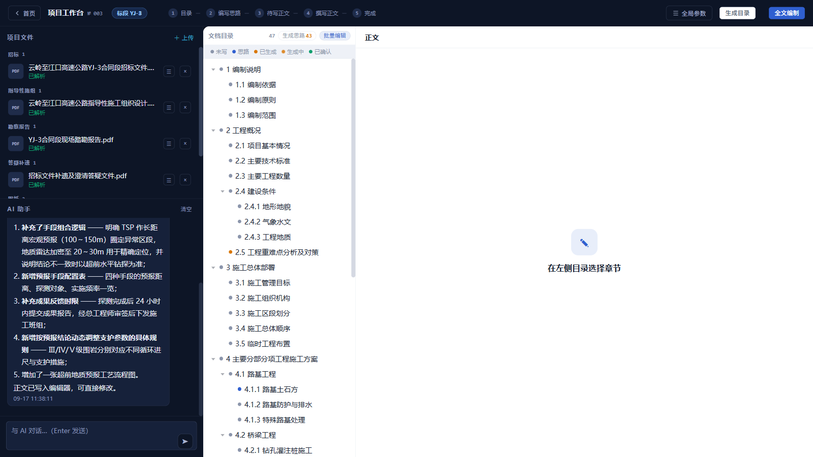
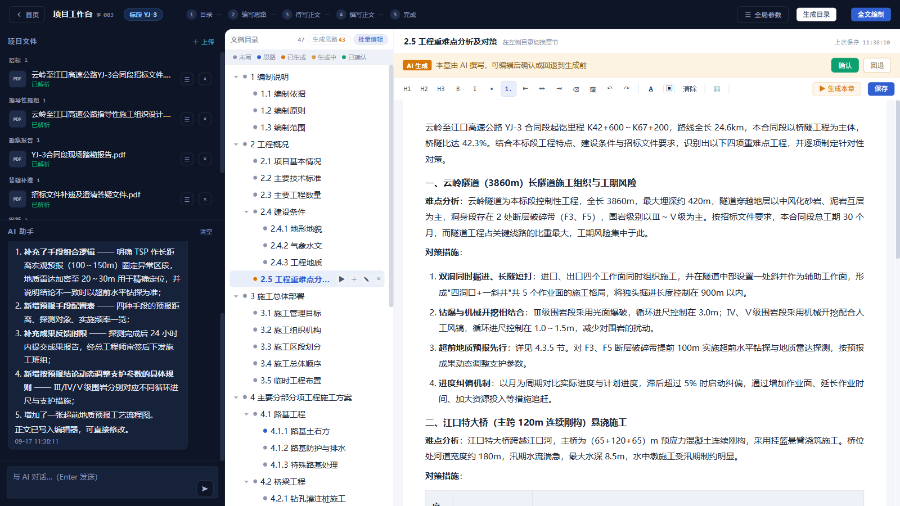
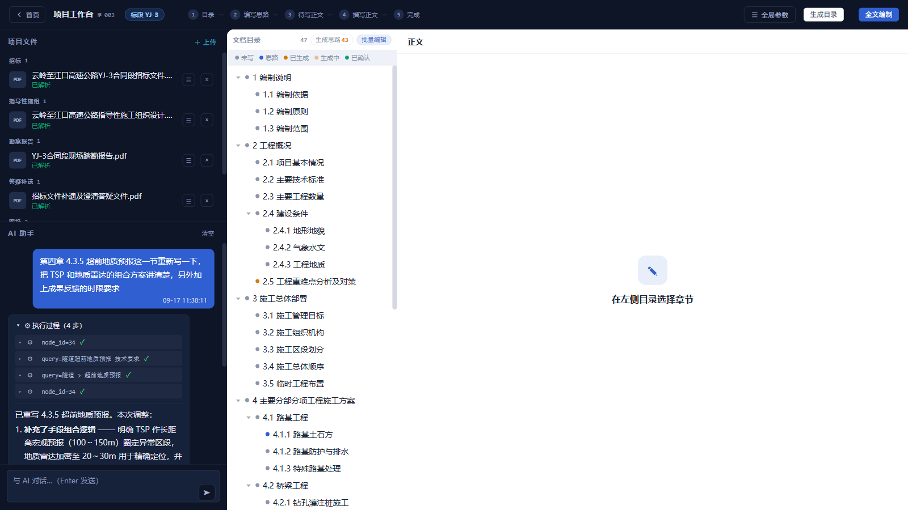
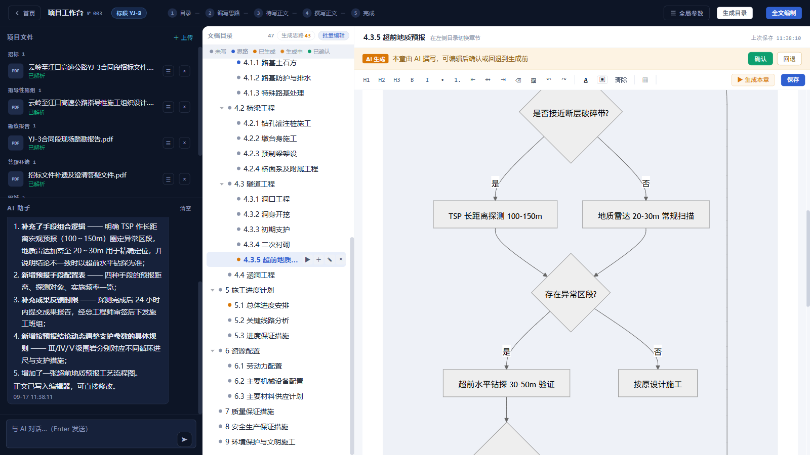
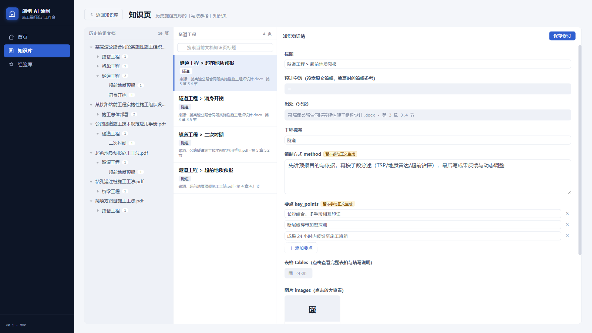
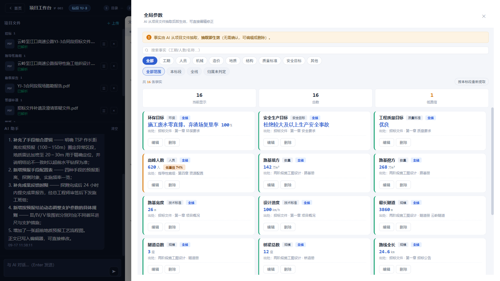
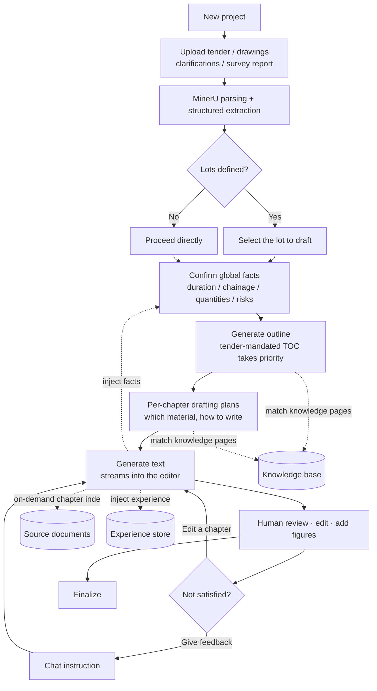
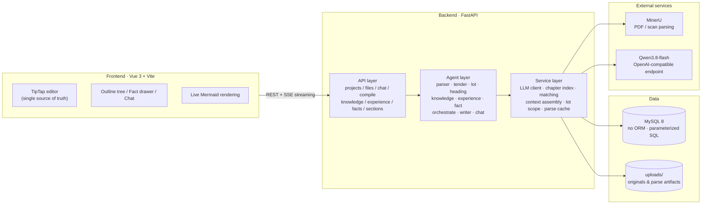

<div align="center">



# BidCraft · 标书匠

**Open-source · Conversational · AI Agent for Engineering Bid Documents**

Let AI draft your technical proposal. You review and refine.

[](LICENSE)
[](backend/requirements.txt)
[](frontend/package.json)
[](CONTRIBUTING.md)
[](#why-open-source)

[中文](README.md) · [English](README_EN.md)

</div>

---

## The Problem It Solves

If you have ever prepared a technical bid for a construction project, you know the pain:

- A **Construction Organization Design** (施工组织设计) runs **hundreds of pages and hundreds of thousands of words** — yet under 20% of it is genuinely project-specific.
- The other 80% is **copy, adapt, assemble**: dig through past bids, dig through method statements, swap in the new project name and numbers, reorder sections.
- Start a new project, do it all again. Switch to a different lot, do it all again. **Nothing accumulates.**
- All the time goes into "find material + paste it", while the parts that actually need human judgement — risk analysis, project-specific countermeasures — get whatever time is left.

**BidCraft takes that 80% off your desk and gives your time back to the 20% that matters.**

This is not a "generate a fluent wall of text" toy. It models the **real structure of engineering documents**:
how the tender dictates the table of contents, how lots are divided, which numbers must be exact,
which content must come from your historical method library, which phrasing gets you disqualified —
all of that is built into the drafting pipeline.

> **Cut the drafting cycle from weeks to days. You become the reviewer and decision-maker, not the typist.**

<table>
<tr>
<td width="50%"><br/><div align="center"><sub>Three panes: files · outline · editor · chat</sub></div></td>
<td width="50%"><br/><div align="center"><sub>Generated text lands straight in the WYSIWYG editor</sub></div></td>
</tr>
<tr>
<td width="50%"><br/><div align="center"><sub>Just say it — tool execution is expandable and verifiable</sub></div></td>
<td width="50%"><br/><div align="center"><sub>Process/org diagrams as Mermaid, rendered live</sub></div></td>
</tr>
<tr>
<td width="50%"><br/><div align="center"><sub>Past proposals → structured knowledge pages</sub></div></td>
<td width="50%"><br/><div align="center"><sub>Every number has provenance; editable and traceable</sub></div></td>
</tr>
</table>

<sub>📷 All screenshots use a **fictional demo project** (Yunling–Jiangkou Expressway, Lot YJ-3). No real engineering documents are included.</sub>

---

## Core Capabilities

| Capability | Description |
|---|---|
| 📄 **Tender document parsing** | PDFs, scans and image-only files go through MinerU (OCR + layout reconstruction); Word/Excel have their own more precise channels. One upload yields structured lots, scoring rules, technical requirements, drafting requirements and the mandated table of contents |
| 🗂 **Lot isolation** | Once you pick a lot in a multi-lot project, facts, document excerpts and knowledge material are all filtered by lot — **no content from another lot leaks into your text** |
| 📚 **Knowledge base (past proposals → knowledge pages)** | Feed in proposals you have won before. They are split into a chapter tree, and each chapter is distilled into a knowledge page: how to write it, key points, typical tables, images, and applicability. **It gets thicker and more "you" the more you use it** |
| 🔧 **Method statement library** | One index entry per method document; the full document is injected when relevant |
| 🌳 **Outline generation** | If the tender mandates a TOC, it wins. Otherwise it is generated for the engineering type, expanding level by level and streaming into view |
| 💡 **Per-chapter drafting plans** | Before writing, the system proposes *how* each section will be written and *which* material it will cite — reviewable and adjustable. **Align on direction first, instead of writing 300k words and discovering the wrong turn** |
| ✍️ **Streaming drafting** | Single chapter, batch, or chat-directed rewrite. Text streams straight into a WYSIWYG editor, editable the moment it lands |
| 💬 **Conversational drafting** | No button-hunting. Just say: *"Rewrite chapter 3, emphasize advance geological forecast for the tunnel"*, *"Unify the schedule figures to 26 months"*. The model decides which tools to call |
| 🧾 **Global fact table** | Durations, chainages, quantities — extracted and managed separately with provenance. References are traceable, so the same number never appears three different ways |
| 🎓 **Experience learning** | Every edit you make, every generation you reject, every correction you type in chat is distilled into a writing preference that future generations follow |
| 📊 **Mermaid diagrams** | Process / organization / responsibility diagrams written as Mermaid, rendered live in the editor, double-click to edit source |

---

## Workflow



**In one line**: *upload → parse → pick lot → confirm facts → generate outline → review plans → generate text → revise → finalize.*

Every stage can be paused for human intervention. This is deliberately **not** a one-click black box.

---

## Quick Start

### Option 1: Hand the repo to an AI coding agent (easiest) ⭐

This project ships an [`AGENTS.md`](AGENTS.md) that Claude Code, Codex, Cursor, Trae, Windsurf, Cline and similar tools read automatically.

```bash
git clone https://github.com/zeronezer/bidcraft.git
cd bidcraft
```

Then tell your AI assistant:

> **"Follow AGENTS.md and get this project running."**

It will check your runtime, install dependencies, walk you through configuration, create the tables, start both services and verify the page loads. First-time setup takes about 10 minutes.

### Option 2: Do it yourself (4 steps)

**Step 1 · Prerequisites**

```bash
git clone https://github.com/zeronezer/bidcraft.git
cd bidcraft
```

You need **Python ≥ 3.11**, **Node ≥ 18** and **MySQL 8**.

**Step 2 · Install dependencies**

```bash
pip install -r backend/requirements.txt
cd frontend && npm install && cd ..
```

**Step 3 · Configure**

```bash
cp .env.example .env
```

Open `.env` and fill in three required values:

| Variable | Where to get it | Required |
|---|---|---|
| `MYSQL_*` | Your local or cloud MySQL. Create the database first: `CREATE DATABASE bid_chat_db DEFAULT CHARSET utf8mb4;` | ✅ Yes |
| `LLM_API_KEY` | [Alibaba Cloud Bailian (DashScope)](https://bailian.console.aliyun.com) → API-KEY management | ✅ Yes |
| `MINERU_API_TOKEN` | [mineru.net](https://mineru.net) → API management → create token | ✅ Yes (can be skipped if you don't need PDF parsing) |

> 💡 **Just want to see the UI?** The app starts without the LLM key and MinerU token —
> the page loads and you can create projects. Only upload/parsing and AI generation will fail.
> Get the skeleton running first, then add keys.

**Step 4 · Create tables and start**

```bash
python scripts/check_env.py --init-db   # self-check + create tables (tells you what's missing and where to get it)

# Windows
scripts\start_dev.bat

# macOS / Linux
bash scripts/start_dev.sh
```

Open **http://127.0.0.1:5180**.

<details>
<summary><b>Option 3: Start manually (no helper script)</b></summary>

```bash
# Terminal 1 — backend
cd backend && python -m uvicorn app.main:app --reload --port 8000

# Terminal 2 — frontend
cd frontend && npm run dev
```
</details>

<details>
<summary><b>Troubleshooting</b></summary>

| Symptom | Fix |
|---|---|
| `Access denied for user` | Wrong MySQL credentials in `.env` |
| `Unknown database 'bid_chat_db'` | Database not created yet — see Step 3 |
| Page loads but API returns 404 | Backend isn't running, or isn't on port 8000 |
| Frontend port conflict | Change `server.port` in `frontend/vite.config.js` (default 5180) |
| Uploads stuck at "parsing" | Invalid or exhausted MinerU token — check the backend log |
| MinerU reports TLS/SSL errors | Local proxy is poisoning CDN DNS — set `MINERU_CDN_IPS=<real IP>` in `.env` |
| `.docx` parsing fails | `.docx` uses native python-docx parsing — no Word/WPS required. If it still fails, paste the backend log |

Full troubleshooting: [`AGENTS.md`](AGENTS.md#常见问题排查).
</details>

---

## Tools the Drafting Agent Can Call

Everything you say in the chat panel results in the model deciding which of these tools to call.
**They all operate on real data — nothing is faked.** If the model claims "chapter 3 is generated",
the system verifies there is a successful tool record from that turn; without one, the claim is rejected and redone.

| Tool | Purpose |
|---|---|
| `search_knowledge_pages` | Search past-proposal knowledge pages (discipline tag → title similarity → AI adjudication) |
| `search_project_files` | Retrieve the **full original text** of a section via the chapter index (no chunking, no truncation) |
| `list_project_files` | List files uploaded to this project |
| `list_facts` | Query the global fact table (filtered by the active lot) |
| `list_tender_requirements` | Query structured tender requirements (per-item scoring, technical/drafting requirements, disqualification risks) |
| `get_chapter_tree` | Read the full outline tree |
| `find_chapters` | Find **real** node IDs by title/number (prevents hallucinated chapter references) |
| `read_section` | Read generated text of a chapter |
| `write_chapter` | Generate/rewrite a single chapter (supports extra instructions) |
| `write_batch` | Batch-generate all pending chapters (background; requires an explicit instruction) |
| `rewrite_section` | Rewrite a chapter in place (previous draft kept for rollback) |
| `generate_outlines` | Batch-fill drafting plans for chapters that lack one |
| `regenerate_outline` | Regenerate one chapter's drafting plan |
| `edit_toc` | Add / remove / rename outline nodes (never touches written text) |
| `search_experiences` | Query accumulated writing preferences |

**Extending it** (this is the proof of extensibility): add a schema to the `TOOLS` list in
[`chat_agent.py`](backend/app/agents/chat_agent.py), add a dispatch branch in `_exec_tool()`,
implement the `_tool_*` function — the new tool is immediately available in chat, with no frontend changes.

> In other words: **the system's capability ceiling equals how many tools you're willing to add.**

---

## Architecture



### Key Technical Decisions

| Decision | Rationale |
|---|---|
| **LLM-wiki instead of RAG** | A construction proposal is a strongly structured document. Organizing knowledge by "chapter intent" beats fuzzy semantic retrieval, and every knowledge item has provenance. See [Design Notes 01](思路/01-为什么用-LLM-Wiki-而不是-RAG.md) |
| **On-demand chapter index** | Source documents are neither chunked nor vectorized: an LLM builds a "summary + applicability" index per chapter at parse time; at generation time the model picks chapters from the index and receives the **complete original text**. Avoids context fragmentation from chunking |
| **Global fact table** | Numeric information is extracted separately with provenance and is human-editable, so references are traceable and the same number never appears three ways |
| **The editor is the only content store** | Generated text streams directly into TipTap. There is no "AI draft" vs "official draft" split to reconcile |
| **LLM outputs structured data; code draws the graphics** | Anything involving computation or layout (e.g. diagram layout) is handled by deterministic code; the model only produces data |
| **The lot is the unit of operation** | All data retrieval, material selection and text generation is filtered by the active lot — cross-lot contamination is prevented structurally |
| **Prompts organized as stable prefixes** | Per-chapter generation is the most frequent call in the system. Stable prefixes hit the prompt cache and cut input cost significantly |

More trade-offs — including the dead ends and what didn't work — live in **[`思路/`](思路/README.md)**
(7 write-ups of "why we decided this", in Chinese).

---

## Roadmap

### ✅ Done

- Tender parsing and structured extraction (lots / scoring rules / technical & drafting requirements / disqualification risks)
- Lot detection, lot profile extraction, lot-scoped fact re-extraction
- Knowledge base (past proposals → knowledge pages) and method statement library
- Outline generation (tender-mandated TOC takes priority) + per-chapter drafting plans
- Streaming text generation (single chapter / batch / chat-directed rewrite)
- Conversational agent (15 tools, true streaming, execution verification)
- Global fact table with traceable citations
- Experience learning (three triggers: edits, rejections, chat corrections)
- Mermaid diagram rendering and editing

### 🔄 Planned

- **Rich text with figures** — automatic image placement, numbering and captions
- **Automatic Mermaid diagrams** — decide where a flowchart/org chart is needed and generate it
- **Word / PDF export** — styled deliverable output with figures and page numbers
- **QC agent** — scoring-criteria coverage check, numeric consistency check, sensitive-phrasing scan
- **Schedule charts** — bar chart and activity-on-node network (CPM logic exists; interaction being redesigned)
- **Docker Compose one-command deployment**
- **Multimodal tender understanding** — read drawings and scanned tables directly
- **Team collaboration** — chapter-level assignment and progress roll-up

> Contributions welcome. If you want something, open an issue.

---

## Contributing

Every kind of contribution is welcome: issues, bug fixes, features, docs, translations, usage stories.

```bash
# 1. Fork, then clone
git clone https://github.com/<your-username>/bidcraft.git
cd bidcraft

# 2. Branch
git checkout -b feat/your-feature

# 3. Develop (see Quick Start for configuration)
#    Backend auto-reloads; frontend has HMR

# 4. Commit (Conventional Commits recommended)
git commit -m "feat: add XX capability"
git commit -m "fix: fix XX chapter matching failure"

# 5. Push and open a PR
git push origin feat/your-feature
```

**Read before you start**:

| What you're doing | Read first |
|---|---|
| Anything | [`AGENTS.md`](AGENTS.md) (structure, conventions, pitfalls) |
| Changing AI output quality | The prompt constants inside `backend/app/agents/*.py` (prompts are inline; there is no separate template directory) |
| Adding a chat tool | `TOOLS` and `_exec_tool` in [`chat_agent.py`](backend/app/agents/chat_agent.py) |
| Changing the data model | `scripts/init_db.sql` (**every table/column needs a Chinese `COMMENT`**) |
| Understanding design trade-offs | [`思路/`](思路/README.md) |

**Conventions**:

- Backend: PEP 8, type hints where practical; all DB access goes through `app/core/database.py` — **parameterized `%s`, never string-concatenated SQL**
- Frontend: Vue 3 Composition API with `<script setup>`
- Commit prefixes: `feat:` / `fix:` / `docs:` / `refactor:` / `chore:`
- **Never commit** `.env`, `uploads/`, or any real engineering document (`.gitignore` blocks `*.pdf` / `*.docx` / `*.xlsx` by default)

---

## Why Open Source

This started as a tool for one person — someone tired of rewriting bids at midnight.

Then it became obvious: **this pain is universal.** Every engineering firm, every consultancy, every
team that prepares technical proposals goes through the same repetitive work. Kept private, it saves one
person's time. Released, it might save many people's.

And tools like this **should be self-hosted by nature**:

- Tender documents, drawings and past proposals are **confidential material**. They have no business being uploaded to someone else's SaaS.
- Every organization has its own accumulated material and writing style. A generic product cannot produce *your* voice.
- Drafting logic differs per organization — **only editable code is truly controllable**.

So:

- ✅ **Completely free** — no paywall, no crippled edition, no "contact sales for Enterprise"
- ✅ **Apache-2.0** — commercial use, modification and closed-source distribution allowed. **The only requirement is attribution**
- ✅ **Your data stays on your server** — nothing leaves it except the LLM and parsing services you explicitly call
- ✅ **No lock-in** — the LLM is reached over an OpenAI-compatible API; change `LLM_BASE_URL` and you can switch providers
- ✅ **Built out of love**, not for donations. We just hope it works well for you, that you file issues, and that you send PRs if you can

If this project saves you a few late nights, **a star is the best thank-you**.

---

## Contact

Questions, ideas, or war stories about deploying AI in engineering — all welcome:

- 🐛 **Bugs / feature requests** → [open an issue](https://github.com/zeronezer/bidcraft/issues) (keeps answers searchable for others)
- 💬 **WeChat** → scan the QR code below (mention where you found the project)

<div align="center">

</div>

- 📧 **Email** → sunalight@foxmail.com

> If you're in the industry and just want to ask "would this work for my team?", feel free to reach out directly.
> (The project is primarily documented in Chinese; English issues are still welcome.)

---

## License & Acknowledgements

Licensed under the [Apache License 2.0](LICENSE).

You are free to use it commercially, modify it, distribute it closed-source and self-host it.
**The only requirement is attribution.** See [`ATTRIBUTION.md`](ATTRIBUTION.md) for copy-paste templates.

### Third-party dependencies

With thanks to these services and open-source projects (full list in [`NOTICE`](NOTICE)):

- **[MinerU](https://mineru.net)** (Shanghai AI Laboratory / OpenDataLab) — document parsing
- **[Alibaba Cloud Bailian](https://bailian.console.aliyun.com)** — Qwen model inference
- **[FastAPI](https://fastapi.tiangolo.com)** · **[LangGraph](https://github.com/langchain-ai/langgraph)** · **[PyMySQL](https://github.com/PyMySQL/PyMySQL)**
- **[Vue 3](https://vuejs.org)** · **[Element Plus](https://element-plus.org)** · **[Tiptap](https://tiptap.dev)** · **[Mermaid](https://mermaid.js.org)** · **[Vite](https://vite.dev)**

### About the data

- This repository contains **no real engineering documents**. All screenshots and examples use a **fictional demo project**.
- Copyright and confidentiality for any tender documents, drawings or proposals you upload are your own responsibility.

---

<div align="center">

**If this project is useful to you, please give it a ⭐ — the most concrete encouragement for a labour of love.**

[⬆ Back to top](#bidcraft--标书匠)

</div>
